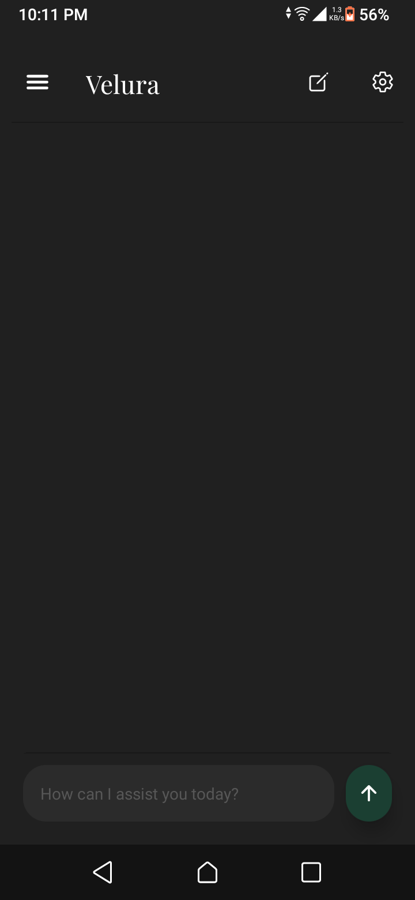

# Vexria API

> AI-powered backend for the Vexria medical assistant.

**Vexria API** is the backend service that powers the Vexria mobile application. It is responsible for processing user requests, coordinating AI models, analyzing medical conversations, classifying message risk levels, and managing the application's medical logic.

> **Project Status:** Early Access / Active Development

---

## Preview




---

## Main Features

- AI-powered medical conversations.
- Medical risk classification system.
- Multi-model LLM support through OpenRouter.
- Medical information extraction *(currently under development)*.
- Image analysis pipeline *(currently under development)*.
- AI response post-processing *(currently under development)*.
- Medical profile management.
- Flask REST API.

---

## Project Structure

```
vexria-api/

│
├── ai/
│   AI models and reasoning logic
│
├── system/
│   Core application logic
│
├── medical_profile/
│   Medical profile processing
│
└── app.py
```

---

## Technology Stack

- Python
- Flask
- OpenRouter
- Firebase
- REST API

---

## AI Capabilities

The backend supports multiple Large Language Models (LLMs) through OpenRouter, allowing flexible model selection depending on availability and performance.

Supported model families include:

- Qwen
- GPT OSS
- Llama
- Gemma
- Hermes
- Nemotron
- Liquid

---

## Current Development

The project is under active development.

Some modules are already functional, while others are still being implemented.

### Stable

- AI chat
- Risk classification
- Backend API
- Medical profile handling

### In Progress

- Medical information extraction
- Medical image analysis
- AI response verification
- Automatic summaries

---

## API

The backend exposes multiple REST endpoints used by the Vexria mobile application.

Examples include:

- Chat processing
- Medical summaries
- User profile management
- AI response generation

---

## Security

Sensitive credentials are stored using environment variables and are not included in this repository.

---

## Future Roadmap

- Better image analysis
- Improved AI reasoning
- Additional medical tools
- Better performance
- Expanded model support

---

## License

This project is currently proprietary.

Source code is available for portfolio purposes only.

---

Created by **Oulfa**